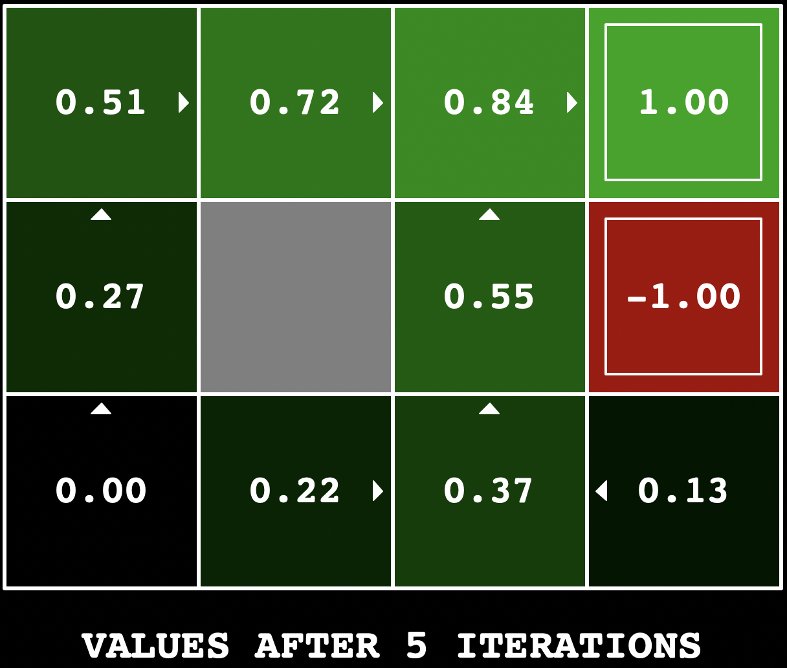
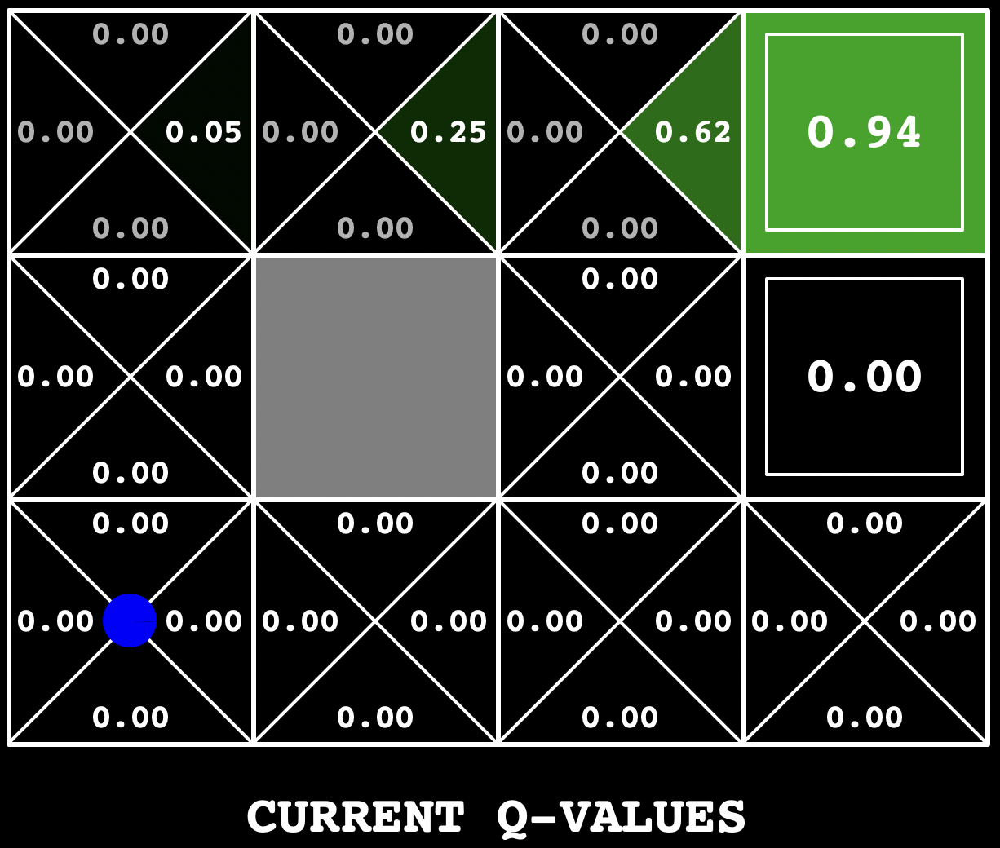

# Reinforcement Learning

This project implements value iteration and Q learning and tests the agents on various different applications such as Gridworld, a simulation robot controller called Crawler, and Pacman. 

## Project Description

This project explores solving Markov Descision Processes with reinforcement learning. A Markov Decision Process is a framework for modeling decision making in worlds wehre outcome are random and there is not total control of what actions are carried out by an agent in this world. For this project, a value iteration agent has been written to compute a policy for different gridworld layouts. Value iteration is a technique that pre-plans policies, and agents then follow the policy in real time. This method of decision making begins to break down when the world changes or if there is uncertainty in the actions that may get carried out. Thus, Q-Learning was implemented so that the programmed agent can learn from experience to develop a policy. The Q-Learning algorithm is tested in grid world where the agent tries to find the best policy to maximize reward. It is also tested by running it on the simulated robot controller. called crawler. In crawler, the robot tries to learn to crawl across the path. Finally, the Q-Learning agent is tested in games of PacMan. 

Value Iteration is implemented in the **valueIterationAgents.py** file. 
Q Learning is implemented in the **qlearningAgents.py** file. 

## Running the Project

### Testing out the Code 

First, one will need to clone this repo. To get started, I recommend running the following command to run Gridworld in manual control mode:

```bash
python3 gridworld.py -m
```

This will open the grid world and show a blue dot which is the agent for this world. The arrow keys are used to move the agent around the grid. One thing to note, is that the up key only moves the agent 80% of the time, modeling uncertainty in carrying out a decision. 

There are many options available for running the gridworld program, and they can be seen by running the following command: 

```bash
python3 gridworld.py -h
```

### Value Iteration

To run value iteration on gridworld, the following command can be used: 

```bash
python3 gridworld.py -a value -i 100 -k 10
```

This command runs value iteration 10 times, each time 100 times, to obtain optimal Q values for the grid. At the end of the iteration, a grid will show that depicts the policy computed from value iteration. An example of a policy returned by value iteration found by running value iteration for 5 iterations can be seen here: 



### Q-Learning

To run q learning on gridworld under manual control, the following command can be used: 

```bash
python3 gridworld.py -a q -k 5 -m
```

This Q-Learning agent learns an optimal policy over 5 episodes. If the blue dot is steered North and then East for 4 episodes, the following Q-values will be seen: 



To run the Q-Learning agent in the crawler environment and for pacman, run the following commands: 

```bash
python3 crawler.py
python3 pacman.py -p PacmanQAgent -x 2000 -n 2010 -l smallGrid
```
